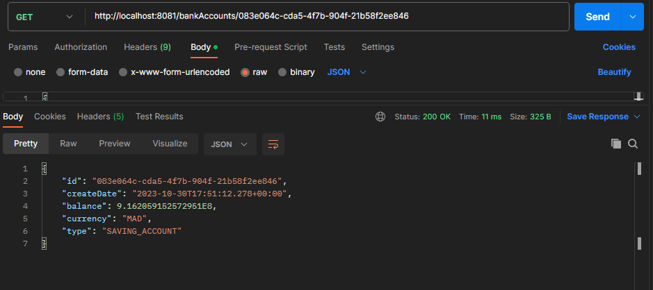
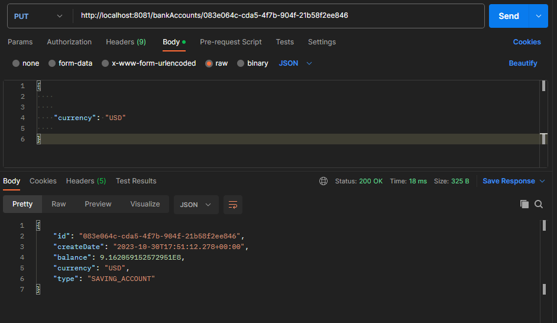

# Développement d'un Micro-Service

Ce Tp consiste à créer un micro service qui permet de gérer des comptes bancaires.

## Architecture:

Travail à réaliser  :

1. Créer un projet Spring Boot avec les dépendances Web, Spring Data JPA, H2, Lombok

2. Créer l'entité JPA Compte

3. Créer l'interface CompteRepository basée sur Spring Data

4. Tester la couche DAO
#### Creation des comptes sur le fichier Aplication en utilisant le builder:

#### Configuration de la DB sur le fichier properties:

#### Resultat du test:

5. Créer le Web service Restfull qui permet de gérer des comptes

6. Tester le web micro-service en utilisant un client REST comme Postman
#### Liste des comptes

#### Afficher un compte by l'id

#### Modifier un compte avec Put

7. Générer et tester le documentation Swagger de des API Rest du Web service
#### On ajoute la dependance "SpringDoc OpenAPI UI" dans pom.xml

#### La documentation Swagger

###### la docummentation sous forme Json : L'interface du WebService elle contient:les paths, input,outpu

8. Exposer une API Restful en utilisant Spring Data Rest en exploitant des projections
9. Créer les DTOs et Mappers
10. Créer la couche Service (métier) et du micro service
11. Créer un Web service GraphQL pour ce Micro-service

