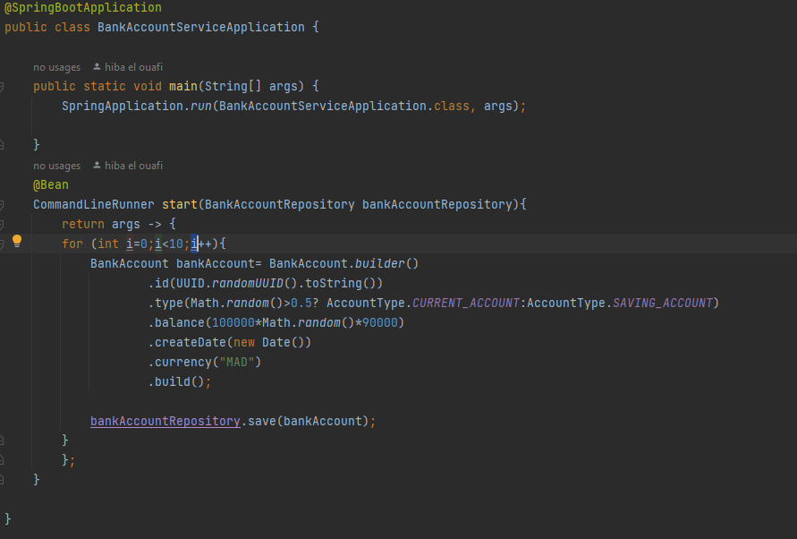
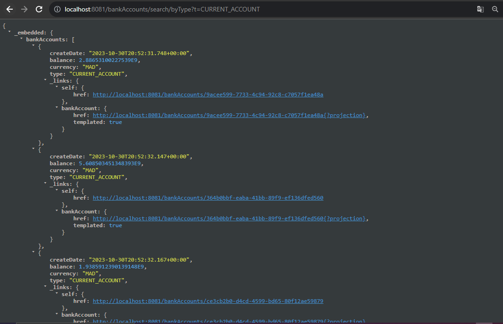
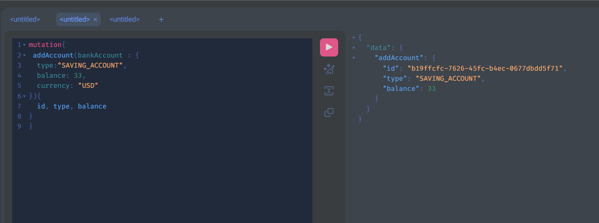

# Développement d'un Micro-Service

Ce Tp consiste à créer un micro service qui permet de gérer des comptes bancaires.

## Architecture:

Travail à réaliser  :

1. Créer un projet Spring Boot avec les dépendances Web, Spring Data JPA, H2, Lombok

2. Créer l'entité JPA Compte

3. Créer l'interface CompteRepository basée sur Spring Data

4. Tester la couche DAO
#### Creation des comptes sur le fichier Aplication en utilisant le builder:

#### Configuration de la DB sur le fichier properties:

#### Resultat du test:

5. Créer le Web service Restfull qui permet de gérer des comptes

6. Tester le web micro-service en utilisant un client REST comme Postman
#### Liste des comptes

#### Afficher un compte by l'id

#### Modifier un compte avec Put

7. Générer et tester le documentation Swagger de des API Rest du Web service
#### On ajoute la dependance "SpringDoc OpenAPI UI" dans pom.xml

#### La documentation Swagger

###### la docummentation sous forme Json : autrement dis c'est L'interface de notre api elle contient:les paths, input,outpu

8. Exposer une API Restful en utilisant Spring Data Rest en exploitant des projections
#### Télecharger l'independance Spring Data Rest
Spring Data REST est une extension de Spring Data qui simplifie la création de 
Web Services REST à partir de vos classes d'entités JPA (Java Persistence API) 
et de vos référentiels Spring Data. Il permet de créer des points de terminaison
REST automatiquement pour effectuer des opérations CRUD (Create, Read, Update,
Delete) sur vos données.

#### Accéder au localhost:8081/bankAccounts

##### les projections

9. Créer les DTOs et Mappers

#### les DTOs:

#### les Mappers:

10. Créer la couche Service (métier) et du micro service

11. Créer un Web service GraphQL pour ce Micro-service
### Ajouter la dependance:

### Creer un Controller pour GrapghQl:

### Modifier le fichier application.properties:

### Creer un fichier Schema.grapghqls:
- Un fichier qui fait la description du service.GraphQL est un langage de requête pour les API
qui permet aux clients de demander uniquement les données dont ils ont
besoin.
- Dans GraphQL, les termes "query" et "mutation" sont deux types de 
- requêtes que vous pouvez utiliser pour interagir avec un système de données via une API GraphQL
##### --1------- Query  :
elle est utilisée pour récupérer des données que le client souhaite recevoir 
dont il a besoin, ni plus ni moins.

##### --1------- Mutation  :
elle  est utilisée pour effectuer des opérations de modification des données sur 
telles que la création, la mise à jour ou la suppression de données.
Comme les requêtes, les mutations sont également définies du côté du client.

### On test les methodes du Controller:
La liste des comptes on spécifiant les attribus qu'on veut afficher

On cherche un compte by ID toujours on spécifiant les donnees qu'on a besoin

Dans le cas d'un ID qui n'existe pas on reçoit une erreur d'où l'utilité d'ajouter un fichier d'exceptions

Creation du fichier CustomDataFetcherExceptionResolver qui hérite de la classe 
"DataFetcherExceptionResolverAdapter"

le resultat de l'erreur :

  

Pour les operation de modification on utilise mutation
ex: une methode pour ajouter un compte
##### fichier Schema.grapghqls:

  

  

#### on ajoute la methode ds le controller:

apres l'ajout du compte

 

  

en utilisant des parametres:
  

